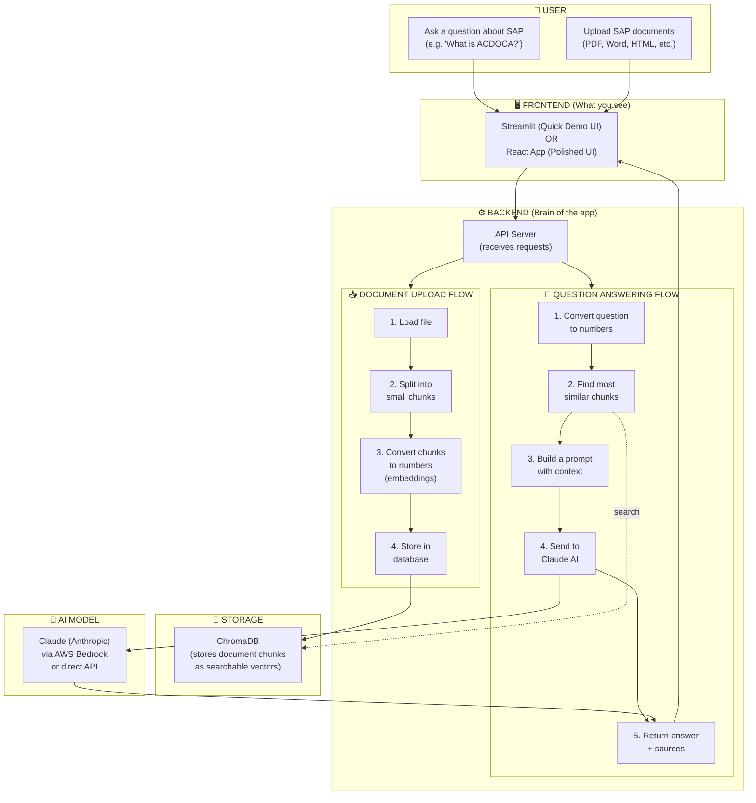

# SAP AI Assistant — Layman Overview

```mermaid
flowchart TB
    subgraph USER["👤 USER"]
        A["Ask a question about SAP<br/>(e.g. 'What is ACDOCA?')"]
        B["Upload SAP documents<br/>(PDF, Word, HTML, etc.)"]
    end

    subgraph FRONTEND["🖥️ FRONTEND (What you see)"]
        C["Streamlit (Quick Demo UI)<br/>OR<br/>React App (Polished UI)"]
    end

    subgraph BACKEND["⚙️ BACKEND (Brain of the app)"]
        direction TB
        D["API Server<br/>(receives requests)"]
        
        subgraph UPLOAD_FLOW["📥 DOCUMENT UPLOAD FLOW"]
            direction LR
            E1["1. Load file"] --> E2["2. Split into<br/>small chunks"]
            E2 --> E3["3. Convert chunks<br/>to numbers<br/>(embeddings)"]
            E3 --> E4["4. Store in<br/>database"]
        end

        subgraph QA_FLOW["💬 QUESTION ANSWERING FLOW"]
            direction LR
            F1["1. Convert question<br/>to numbers"] --> F2["2. Find most<br/>similar chunks"]
            F2 --> F3["3. Build a prompt<br/>with context"]
            F3 --> F4["4. Send to<br/>Claude AI"]
            F4 --> F5["5. Return answer<br/>+ sources"]
        end
    end

    subgraph STORAGE["💾 STORAGE"]
        G["ChromaDB<br/>(stores document chunks<br/>as searchable vectors)"]
    end

    subgraph AI["🤖 AI MODEL"]
        H["Claude (Anthropic)<br/>via AWS Bedrock<br/>or direct API"]
    end

    A --> C
    B --> C
    C --> D
    D --> UPLOAD_FLOW
    D --> QA_FLOW
    E4 --> G
    F2 -.->|search| G
    F4 --> H
    H --> F5
    F5 --> C
```
