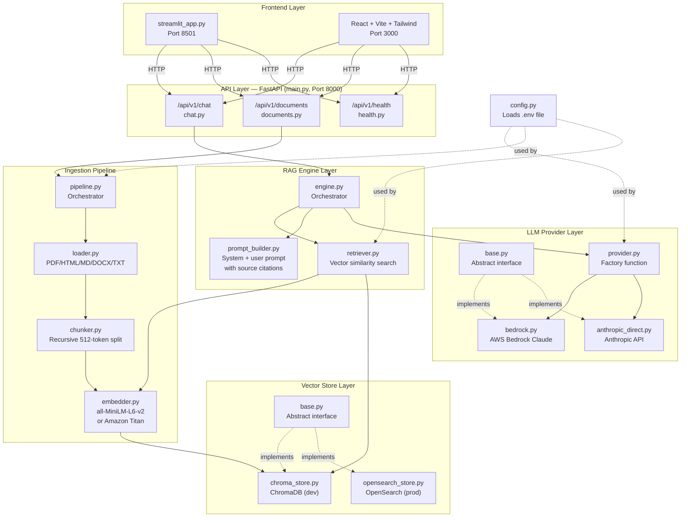

# SAP AI Assistant — Technical Architecture (file-level)

```mermaid
flowchart TB
    subgraph FE["Frontend Layer"]
        ST["streamlit_app.py<br/>Port 8501"]
        REACT["React + Vite + Tailwind<br/>Port 3000"]
    end

    subgraph API["API Layer — FastAPI (main.py, Port 8000)"]
        CHAT_R["/api/v1/chat<br/>chat.py"]
        DOC_R["/api/v1/documents<br/>documents.py"]
        HEALTH_R["/api/v1/health<br/>health.py"]
    end

    subgraph RAG["RAG Engine Layer"]
        RETRIEVER["retriever.py<br/>Vector similarity search"]
        PROMPT["prompt_builder.py<br/>System + user prompt<br/>with source citations"]
        ENGINE["engine.py<br/>Orchestrator"]
    end

    subgraph INGEST["Ingestion Pipeline"]
        LOADER["loader.py<br/>PDF/HTML/MD/DOCX/TXT"]
        CHUNKER["chunker.py<br/>Recursive 512-token split"]
        EMBEDDER["embedder.py<br/>all-MiniLM-L6-v2<br/>or Amazon Titan"]
        PIPELINE["pipeline.py<br/>Orchestrator"]
    end

    subgraph LLM["LLM Provider Layer"]
        BASE_LLM["base.py<br/>Abstract interface"]
        BEDROCK["bedrock.py<br/>AWS Bedrock Claude"]
        ANTHRO["anthropic_direct.py<br/>Anthropic API"]
        PROV["provider.py<br/>Factory function"]
    end

    subgraph VS["Vector Store Layer"]
        BASE_VS["base.py<br/>Abstract interface"]
        CHROMA["chroma_store.py<br/>ChromaDB (dev)"]
        OS["opensearch_store.py<br/>OpenSearch (prod)"]
    end

    CONFIG["config.py<br/>Loads .env file"]

    ST & REACT -->|HTTP| CHAT_R & DOC_R & HEALTH_R
    CHAT_R --> ENGINE
    DOC_R --> PIPELINE
    ENGINE --> RETRIEVER
    ENGINE --> PROMPT
    ENGINE --> PROV
    RETRIEVER --> EMBEDDER
    RETRIEVER --> CHROMA
    PIPELINE --> LOADER --> CHUNKER --> EMBEDDER --> CHROMA
    PROV --> BEDROCK & ANTHRO
    BASE_LLM -.->|implements| BEDROCK & ANTHRO
    BASE_VS -.->|implements| CHROMA & OS
    CONFIG -.->|used by| PROV & PIPELINE & RETRIEVER
```
